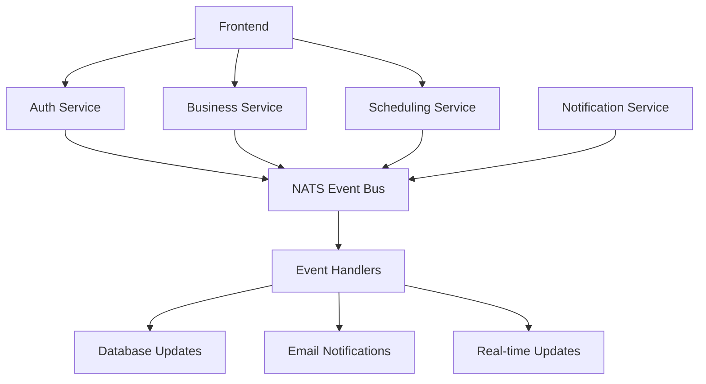

# SlotWise MVP Development Roadmap 🚀

## 🎯 **Infrastructure Foundation - COMPLETE ✅**

The comprehensive dependency management and infrastructure improvements have
been successfully completed, providing a solid foundation for MVP development.

### **✅ Achievements Summary**

- **28% Vulnerability Reduction**: From 43 to 31 vulnerabilities
- **100% Build Success**: All 5 projects building successfully
- **100% Test Success**: All 5 projects testing successfully
- **NATS Event-Driven Architecture**: Validated and ready
- **Nx-Optimized CI/CD**: Intelligent caching and parallel builds
- **Comprehensive Testing Framework**: Unit, integration, and E2E ready

## 🏗️ **MVP Core Booking Flow Implementation**

Based on our established priorities, the next phase focuses on implementing the
core booking functionality with end-to-end user journey and NATS communication.

### **Phase 1: User Registration & Authentication Flow**

#### **Priority: HIGH** 🔴

**Estimated Duration**: 1-2 weeks

#### **User Stories**

- As a user, I want to register for an account so I can access the booking
  system
- As a user, I want to log in securely so I can manage my bookings
- As a business owner, I want to register my business so I can offer booking
  services

#### **Technical Implementation**

##### **Frontend (Next.js)**

```typescript
// User Registration Flow
- /register - User registration form
- /login - User authentication
- /dashboard - User dashboard
- /business/register - Business registration
- /business/dashboard - Business management
```

##### **Auth Service (Go)**

```go
// Core Authentication Features
- JWT token generation and validation
- User registration and login endpoints
- Password hashing and security
- NATS event publishing for user events
```

##### **NATS Events**

```yaml
# User Events
user.registered: { userId, email, userType }
user.authenticated: { userId, sessionId }
business.registered: { businessId, ownerId, businessInfo }
```

#### **Acceptance Criteria**

- [ ] User can register with email/password
- [ ] User can log in and receive JWT token
- [ ] Business owner can register business profile
- [ ] NATS events published for all user actions
- [ ] Frontend displays appropriate dashboards

### **Phase 2: Business Setup & Service Configuration**

#### **Priority: HIGH** 🔴

**Estimated Duration**: 2-3 weeks

#### **User Stories**

- As a business owner, I want to configure my services so customers can book
  them
- As a business owner, I want to set my availability so customers know when to
  book
- As a business owner, I want to define booking rules so the system works
  automatically

#### **Technical Implementation**

##### **Business Service (Node.js/Fastify)**

```typescript
// Business Configuration Features
- Service creation and management
- Availability schedule configuration
- Booking rules and constraints
- Business profile management
```

##### **Scheduling Service (Go)**

```go
// Availability Management
- Time slot generation
- Availability rules processing
- Conflict detection
- Schedule optimization
```

##### **NATS Events**

```yaml
# Business Events
business.service.created: { businessId, serviceId, serviceDetails }
business.availability.updated: { businessId, scheduleId, timeSlots }
business.rules.configured: { businessId, ruleSet }
```

#### **Acceptance Criteria**

- [ ] Business can create and configure services
- [ ] Business can set availability schedules
- [ ] System generates available time slots
- [ ] NATS events coordinate between services
- [ ] Frontend displays service configuration UI

### **Phase 3: Booking Creation & Management**

#### **Priority: HIGH** 🔴

**Estimated Duration**: 2-3 weeks

#### **User Stories**

- As a customer, I want to browse available services so I can choose what to
  book
- As a customer, I want to select a time slot so I can make a reservation
- As a customer, I want to confirm my booking so it's secured

#### **Technical Implementation**

##### **Frontend Booking Flow**

```typescript
// Customer Booking Journey
- /services - Browse available services
- /booking/[serviceId] - Select time slots
- /booking/confirm - Confirm booking details
- /bookings - View customer bookings
```

##### **Scheduling Service Enhancement**

```go
// Booking Management
- Available slot queries
- Booking creation and validation
- Conflict prevention
- Booking state management
```

##### **NATS Events**

```yaml
# Booking Events
booking.requested: { customerId, serviceId, timeSlot }
booking.confirmed: { bookingId, customerId, businessId }
booking.cancelled: { bookingId, reason }
slot.reserved: { serviceId, timeSlot, bookingId }
```

#### **Acceptance Criteria**

- [ ] Customer can browse available services
- [ ] Customer can select available time slots
- [ ] System prevents double-booking conflicts
- [ ] Booking confirmation with unique ID
- [ ] Real-time slot availability updates

### **Phase 4: Booking Confirmation & Notifications**

#### **Priority: MEDIUM** 🟡

**Estimated Duration**: 1-2 weeks

#### **User Stories**

- As a customer, I want to receive booking confirmation so I know it's secured
- As a business owner, I want to be notified of new bookings so I can prepare
- As both parties, I want reminder notifications so appointments aren't missed

#### **Technical Implementation**

##### **Notification Service (Node.js/Fastify)**

```typescript
// Notification Features
- Email confirmation templates (MJML)
- SMS notifications (optional)
- Real-time dashboard notifications
- Reminder scheduling
```

##### **NATS Event Handlers**

```typescript
// Event-Driven Notifications
- Handle booking.confirmed events
- Send confirmation emails
- Schedule reminder notifications
- Update dashboard notifications
```

#### **Acceptance Criteria**

- [ ] Automatic email confirmations sent
- [ ] Business owners notified of new bookings
- [ ] Reminder notifications scheduled
- [ ] Dashboard shows real-time updates
- [ ] Email templates properly rendered

## 🔧 **Technical Architecture**

### **NATS Event-Driven Communication**



### **Database Schema Design**

```sql
-- Core Tables
Users (id, email, password_hash, user_type, created_at)
Businesses (id, owner_id, name, description, settings)
Services (id, business_id, name, duration, price)
Bookings (id, customer_id, service_id, start_time, status)
Availability (id, business_id, day_of_week, start_time, end_time)
```

### **API Endpoints Structure**

```yaml
# Auth Service (Go)
POST /auth/register
POST /auth/login
GET /auth/verify

# Business Service (Node.js)
POST /businesses
GET /businesses/:id
POST /businesses/:id/services
GET /businesses/:id/availability

# Scheduling Service (Go)
GET /services/:id/slots
POST /bookings
GET /bookings/:id
PUT /bookings/:id/status
```

## 📋 **Implementation Checklist**

### **Phase 1: Authentication (Week 1-2)**

- [ ] Set up JWT authentication in auth service
- [ ] Create user registration/login frontend
- [ ] Implement business registration flow
- [ ] Add NATS event publishing
- [ ] Write integration tests

### **Phase 2: Business Setup (Week 3-5)**

- [ ] Build service configuration UI
- [ ] Implement availability scheduling
- [ ] Create booking rules engine
- [ ] Add business dashboard
- [ ] Test NATS communication

### **Phase 3: Booking Flow (Week 6-8)**

- [ ] Create customer booking interface
- [ ] Implement slot availability queries
- [ ] Build booking confirmation flow
- [ ] Add conflict prevention logic
- [ ] Test end-to-end booking flow

### **Phase 4: Notifications (Week 9-10)**

- [ ] Set up email confirmation system
- [ ] Create notification templates
- [ ] Implement reminder scheduling
- [ ] Add real-time dashboard updates
- [ ] Test notification delivery

## 🧪 **Testing Strategy**

### **Unit Tests**

- Service layer business logic
- NATS event handlers
- Database operations
- Authentication flows

### **Integration Tests**

- NATS event communication
- Database transactions
- API endpoint interactions
- Email delivery

### **End-to-End Tests**

- Complete booking flow
- User registration to booking
- Business setup to service delivery
- Notification delivery

## 🚀 **Deployment & Monitoring**

### **Infrastructure Ready**

- ✅ Docker containers optimized
- ✅ Nx build pipeline configured
- ✅ CI/CD with intelligent caching
- ✅ Environment configuration

### **Monitoring Setup**

- [ ] Application performance monitoring
- [ ] NATS message queue monitoring
- [ ] Database performance tracking
- [ ] Error logging and alerting

## 🎯 **Success Metrics**

### **MVP Launch Criteria**

- [ ] User can register and authenticate
- [ ] Business can configure services
- [ ] Customer can complete booking
- [ ] Notifications sent successfully
- [ ] System handles concurrent users
- [ ] All tests passing (>90% coverage)

### **Performance Targets**

- Page load times < 2 seconds
- API response times < 500ms
- NATS message processing < 100ms
- Email delivery < 30 seconds
- 99.9% uptime

---

**🎉 Ready to Begin MVP Development!**

The infrastructure foundation is solid, secure, and scalable. The team can now
confidently implement the core booking functionality with the assurance that the
underlying architecture will support rapid development and reliable operation.

**Next Action**: Begin Phase 1 - User Registration & Authentication Flow
